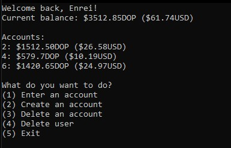

# MonkeyBusiness
Is an application designed to help you keep track of your expenses. This repository contains the source code of the latest version, completely rewritten from scratch.

## IDS326 2022-04 [Grupo 4]
**EnreiKazuri** (Mariano Vásquez, 1087284)

**Pabluedud** (Pablo Edu Diaz, 1096394)

**Manuelusion** (Manuel Mañon, 1095179)

**Carlos1kaiser1Romero** (Carlos Romero, 1090006)


---
**IMPORTANT** MonkeyBusiness' POC is managed on a json inside the proyect, meaning that the app can be tested as soon as it's downloaded without any need of 
modifications. (If you want to run the code on VS Code, there's a separate path in program.cs)

MonkeyBusiness is based around it's AccountHandler, which is the heart of the app, and what makes everything run
```c#
AccountHandler handler = new AccountHandler(@"..\..\..\JsonFiles\Accounts.json", @"..\..\..\JsonFiles\Categories.json"); 
```
> This is the single line found on program.cs, everything is excecuted from the handler.

The handler itself creates an instance of each of the 4 main screens our app is based on
```c#
mainView = new MainView();
userView = new UserView();
accountView = new AccountView();
categoriesView = new CategoriesView();
```
### MainView


The MainView is the start of the app, you can see all created users and their number of current accounts and log into any of them. Log ins are password protected, and
will be compared to the one specified at creation of the account.

```c#
if (handler.appUsers.Where(a => a.Id == int.Parse(decision) && a.Password == pwd).ToList().Count > 0)
```

### UserView


An user logged into MonkeyBusiness can see all of their active accounts, as well as a total balance report, managed in both DOP and USD, exchanged at runtime
by scrapping [infodollar](https://www.infodolar.com.do/).

As seen before, an async call will show a small loading circle until it's completed, as to show the user the app is still working.


Accounts have an unique ID per User meaning that, if deleted, an user will never have an account with the same ID. 
>(e.g., if an user has accounts 1, 2 and 3, andthey delete account #1, their next account will be #4. 1 will never be used again to prevent confusion.
On the same vein, even if #3 was deleted, #4 will be next as all accounts contain this property.)

```c#
if (user.Account.Count > 0) { newid = user.Account.Last().NextId; }
```

### Account


The detailed view of an account shows its balance, as well as the last 5 transactions that have been performed under it.

Transactions englobe both income and expenses, and are accompanied by a short description, as well as the time and date they were registered in.

Examine all transactions, as shown in the gif, will show a historical of every transaction that has been registered on the account. **Contrary to the assignment,**
we have decided to not let an user delete a transaction, as we feel it conflicts with how we initially thought the app should behave.

```c#
for (int i = account.Transactions.Count - 1; i > 0 - 1; i--)
{
  Console.WriteLine("{0}: {1} {2}${3}DOP (${4}USD), {5}", account.Transactions[i].Id, account.Transactions[i].Description,
  account.Transactions[i].GetEnumType(), account.Transactions[i].Amount,
  handler.Converter.ConvertCurrency(account.Transactions[i].Amount, true), account.Transactions[i].Date);
}
```

### CategoriesView


Any transaction created must be identified by a category, if it currently doesn't exist it can be created from the main menu.

Unlike accounts, **Categories will fill deleted items' index,** meaning that there will always be an order to them. If deletion is not the preffered choice,
they can always be modified via their ID.

```c#
public void UpdateCategoriesID()
{
  for (int i = 0; i < categories.Count(); i++)
  {
    categories[i].Id = i + 1;
  }
}
```
